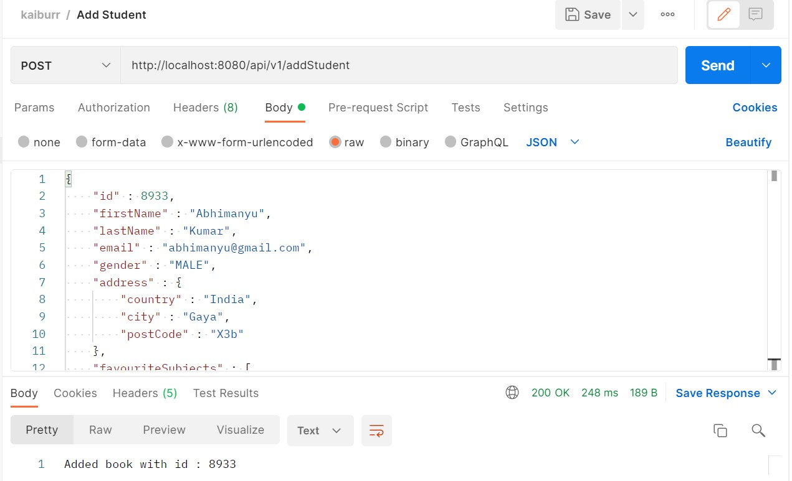
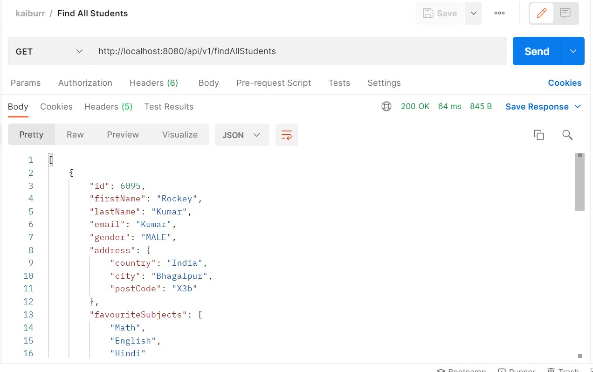
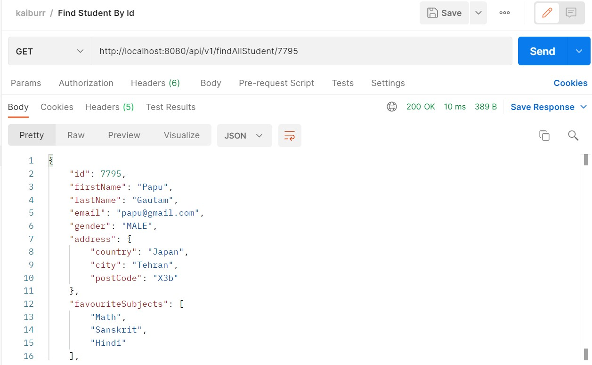
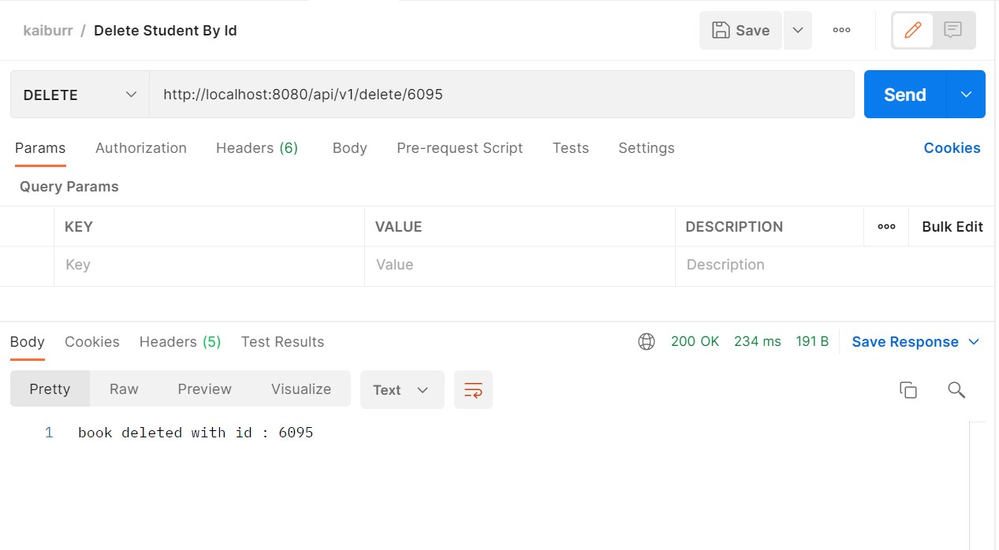
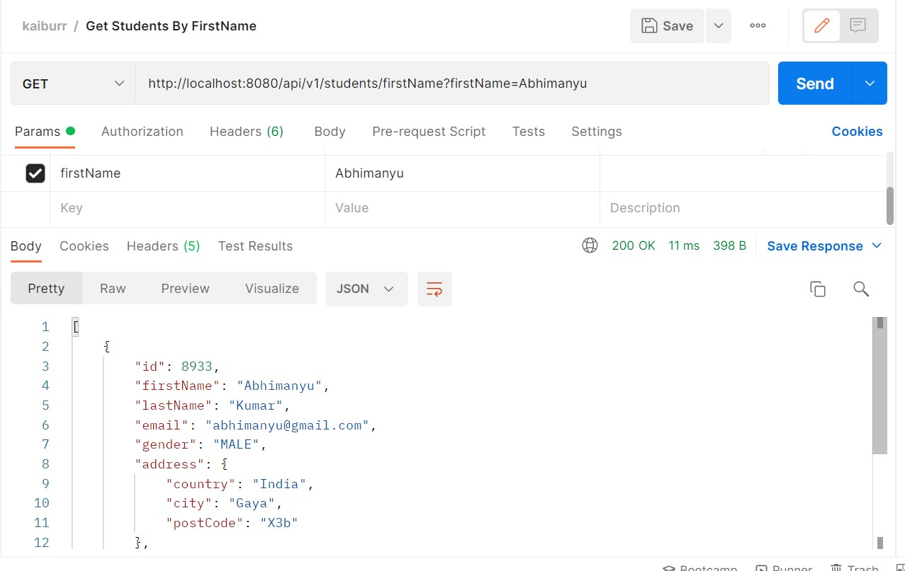
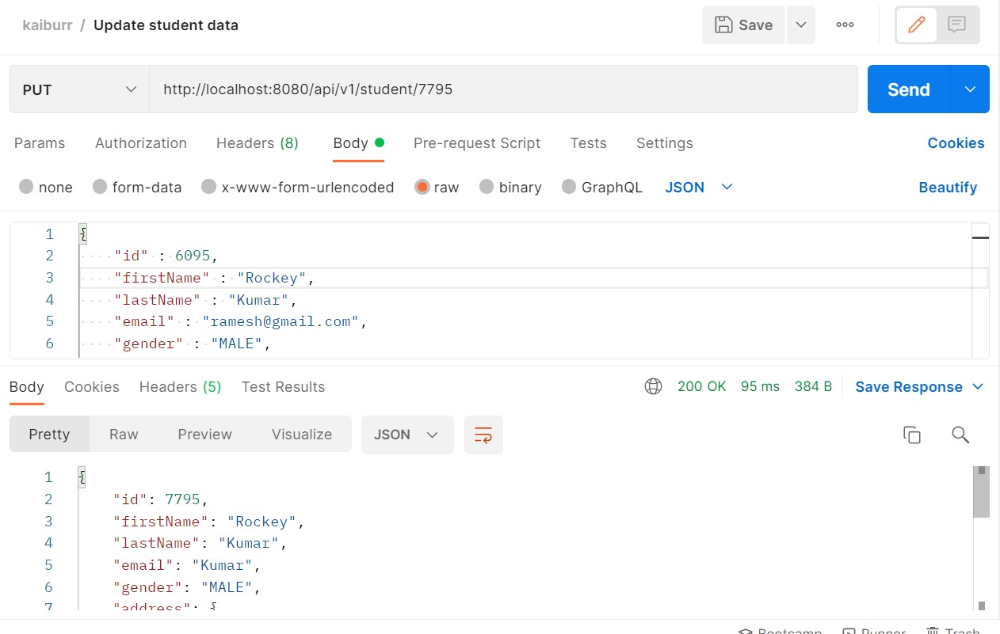

# Task-1

The application demonstrates the REST API using Spring boot and MongoDB. It demonstrates all the database operations like Create, Read, Update and Delete.


## 🚀 About Me
* Abhimanyu Kumar
* Computer Science Student @ CUTM
## 🔗 Links
[](https://www.linkedin.com/in/abhimanyu-k-00b40611a/)


### Tools and Technologies Used
* Spring Boot 2.7.5
* MongoDB
* Spring Tools Suite
* Java 8
* Postman

### Dependencies Used
* Spring Web
* Lombok
* Spring Data MongoDB
* Spring Boot Dev Tools

> **_NOTE:_**  This project is based upon MVC architecture.


## Start MongoDB

To run mongoDB server. Type mongod in the terminal.

```bash
  mongod
```

### Features
### `Insert Data`
* The server object is passed as a json-encoded message body.

Base URL - http://localhost:8080/api/v1/
## POST API

#### Insert student details 

```http
  POST /addStudent
```


## Code

```java
//Add student 
@PostMapping("/addStudent")
public String saveBook(@RequestBody Student student) {
	repository.save(student);
	return "Added book with id : " + student.getId();
}
```


## Screenshot




## `GET API`

#### Get List of all students

```http
  GET /findAllStudents
```


## Code

```java
//Get List of all Students 
@GetMapping("/findAllStudents")
public ResponseEntity<List<Student>> getStudents(){
	List<Student> list = repository.findAll();
	if(list.size() <= 0) {
		return 	ResponseEntity.status(HttpStatus.NOT_FOUND).build();
	}
	return ResponseEntity.of(Optional.of(list));
}
```


## Screenshot



## `Get Student By Id`

#### Get a single student object server

```http
  GET /findAllStudent/{id}
```


## Code

```java
//Get Student By Id
@GetMapping("/findAllStudent/{id}")
public ResponseEntity<Student> getStudentById(@PathVariable int id){
	Student student = repository.findById(id)
			.orElseThrow(()-> new ResourceNotFoundException("Student don't exist with id : " + id));
	return ResponseEntity.ok(student);
}
```


## Screenshot



## `Delete API`

#### Delete a single object of Student

```http
  GET /delete/{id}
```


## Code

```java
//Delete a student using id
@DeleteMapping("/delete/{id}")
public String deleteBook(@PathVariable int id) {
	repository.deleteById(id);
	return "book deleted with id : " + id;
}
```


## Screenshot



## `Get student by firstName`

#### Return a student object having same firstName

```http
  GET /students/firstName
```


## Code

```java
//Get list of student by name
@GetMapping("/students/firstName")
public ResponseEntity<List<Student>> getStudentByName(@RequestParam String firstName){
	List<Student> student = repository.findByFirstName(firstName);
	if(student.size() <= 0) {
		return ResponseEntity.status(HttpStatus.NOT_FOUND).build();
	}
	return ResponseEntity.of(Optional.of(student));
		
}
```


## Screenshot




## `Update API`

#### Update the details of the student object

```http
  GET /student/{id}
```


## Code

```java
//update Student
	@PutMapping("/student/{id}")
	public ResponseEntity<Student> updateStudent(@PathVariable int id, @RequestBody Student studentDetails){
		Student student = repository.findById(id)
				.orElseThrow(()-> new ResourceNotFoundException("Student don't exit with id : " + id));
		
		student.setFirstName(studentDetails.getFirstName());
		student.setLastName(studentDetails.getLastName());
		student.setEmail(studentDetails.getLastName());
		student.setGender(studentDetails.getGender());
		student.setAddress(studentDetails.getAddress());
		student.setFavouriteSubjects(studentDetails.getFavouriteSubjects());
		student.setTotalSpentInBooks(studentDetails.getTotalSpentInBooks());
			
		Student updatedStudent = repository.save(student);
		return ResponseEntity.ok(updatedStudent);
	}
```


## Screenshot




## Acknowledgements

 - [StackOverflow](https://stackoverflow.com/)
 - [Readme.so](https://readme.so/editor)
 

